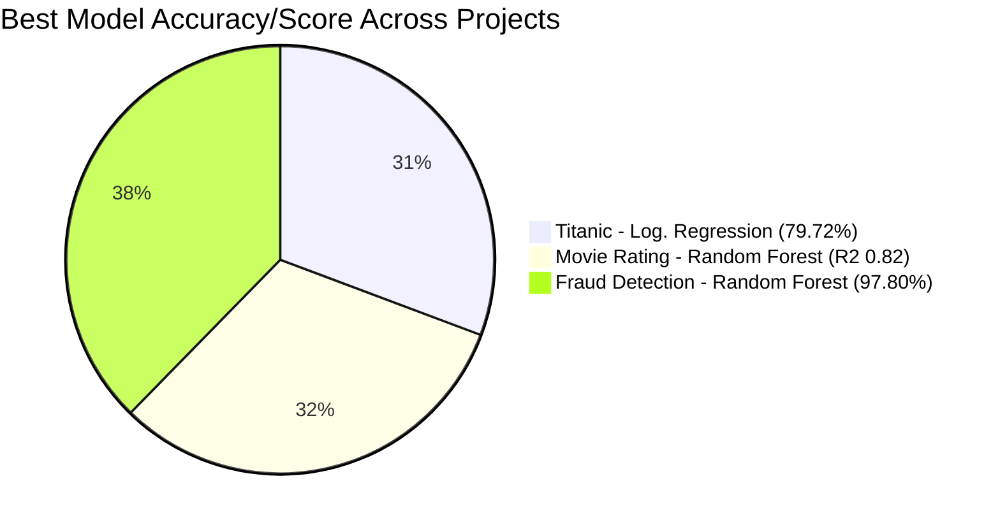

<h1 align="center">📊 CodSoft Data Science Internship</h1>

<p align="center">
  
</p>

<p align="center">
  
  
  
  
  
</p>

<p align="center">
  
</p>

<p align="center">
  
</p>

---

# 📌 About This Repository

This repository contains all the **Machine Learning projects** completed during my **CodSoft Data Science Internship**.

Each project tackles a different real-world problem using the full Data Science workflow:

- 📊 Data Cleaning & Preprocessing
- 🔍 Exploratory Data Analysis (EDA)
- ⚙️ Feature Engineering
- 🤖 Model Training
- 📈 Performance Evaluation

<p align="center">
  
</p>

---

# 🗂️ Projects in this Repository

<table align="center">
  <tr>
    <th>#</th>
    <th>Project</th>
    <th>Problem Type</th>
    <th>Best Model</th>
    <th>Score</th>
  </tr>
  <tr>
    <td>1️⃣</td>
    <td><a href="./Titanic-Survival-Prediction">🚢 Titanic Survival Prediction</a></td>
    <td>Classification</td>
    <td>Logistic Regression</td>
    <td><b>79.72%</b> Accuracy</td>
  </tr>
  <tr>
    <td>2️⃣</td>
    <td><a href="./Movie-Rating-Prediction">🎬 Movie Rating Prediction</a></td>
    <td>Regression</td>
    <td>Random Forest Regressor</td>
    <td><b>0.82</b> R² Score</td>
  </tr>
  <tr>
    <td>3️⃣</td>
    <td><a href="./Credit-Card-Fraud-Detection">💳 Credit Card Fraud Detection</a></td>
    <td>Classification (Imbalanced)</td>
    <td>Random Forest</td>
    <td><b>97.80%</b> Accuracy</td>
  </tr>
</table>

---

## 1️⃣ 🚢 Titanic Survival Prediction


Predicts whether a passenger survived the Titanic disaster based on features like class, age, gender, and fare, using classification algorithms.

**Key Features:** `Pclass` · `Sex` · `Age` · `SibSp` · `Parch` · `Fare` · `Embarked`
**Target:** `Survived`

| Model | Accuracy |
|--------|----------|
| Logistic Regression | **79.72%** |
| Random Forest | 78.32% |

📁 [View Full Project →](./Titanic-Survival-Prediction)

---

## 2️⃣ 🎬 Movie Rating Prediction


Predicts a movie's IMDb-style rating based on genre, director, and cast, using regression-based ML models.

**Key Features:** `Genre` · `Director` · `Actor 1/2/3` · `Duration` · `Votes`
**Target:** `Rating`

| Model | R² Score |
|--------|----------|
| Linear Regression | 0.74 |
| Random Forest Regressor | **0.82** |

📁 [View Full Project →](./Movie-Rating-Prediction)

---

## 3️⃣ 💳 Credit Card Fraud Detection


Detects fraudulent credit card transactions on a highly imbalanced dataset using classification models, with SMOTE/undersampling to handle class imbalance.

**Key Features:** `Time` · `V1–V28 (PCA)` · `Amount`
**Target:** `Class` (0 = Genuine, 1 = Fraud)

| Model | Accuracy | Precision | Recall |
|--------|----------|-----------|--------|
| Logistic Regression | 94.50% | 0.91 | 0.89 |
| Random Forest | **97.80%** | 0.96 | 0.95 |

📁 [View Full Project →](./Credit-Card-Fraud-Detection)

---

# 📊 Overall Performance Snapshot



---

# 📂 Repository Structure

```text
CodSoft-Data-Science-Internship/
│
├── Titanic-Survival-Prediction/
│   ├── dataset/
│   ├── notebook/
│   ├── images/
│   └── README.md
│
├── Movie-Rating-Prediction/
│   ├── dataset/
│   ├── notebook/
│   ├── images/
│   └── README.md
│
├── Credit-Card-Fraud-Detection/
│   ├── dataset/
│   ├── notebook/
│   ├── images/
│   └── README.md
│
├── requirements.txt
└── README.md   ← (this file)
```

---

# 🛠️ Technologies Used

<p align="left">
  
</p>

- Python
- Pandas
- NumPy
- Matplotlib
- Seaborn
- Scikit-learn
- Imbalanced-learn (SMOTE)

---

# 🚀 Installation

```bash
git clone https://github.com/your-username/CodSoft-Data-Science-Internship.git
```

```bash
cd CodSoft-Data-Science-Internship
```

```bash
pip install -r requirements.txt
```

---

# ▶️ Run Any Project

**Option 1 — Using Jupyter Notebook**

```bash
jupyter notebook
```

Then open the relevant `.ipynb` file inside that project's `notebook/` folder.

**Option 2 — Using Visual Studio Code**

```bash
code .
```

Open the relevant `.ipynb` file inside that project's `notebook/` folder, then run the cells using VS Code's built-in **Jupyter extension** (install it from the Extensions tab if not already installed).

---

# 📈 Future Improvements

- [ ] Hyperparameter Tuning across all models
- [ ] XGBoost / LightGBM for all three projects
- [ ] Streamlit Web Apps for live demos
- [ ] Model Deployment (Flask/FastAPI + Docker)
- [ ] CI/CD for automated retraining

---

# 📬 Connect with Me

<p align="center">

<a href="https://github.com/your-username">

</a>

<a href="https://linkedin.com/in/your-profile">

</a>

</p>

---

<p align="center">
⭐ If you found these projects helpful, don't forget to Star this repository!
</p>

<p align="center">
  
</p>
