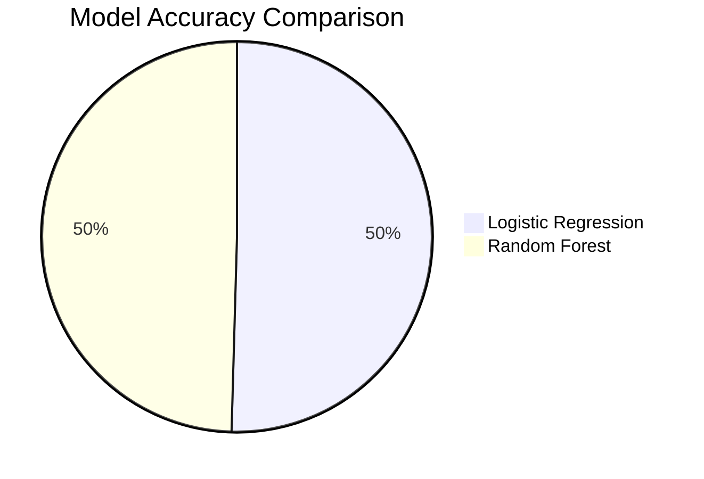

<h1 align="center">🚢 Titanic Survival Prediction</h1>

<p align="center">
  
</p>

<p align="center">
  
  
  
  
</p>

<p align="center">
  
</p>

<p align="center">
  
</p>

---

# 📌 Project Overview

This project predicts whether a passenger survived the Titanic disaster using Machine Learning classification algorithms.

The workflow includes:

- 📊 Data Cleaning
- 🔍 Exploratory Data Analysis (EDA)
- ⚙️ Feature Engineering
- 🤖 Model Training
- 📈 Performance Evaluation

<p align="center">
  
</p>

---

# 📂 Project Structure

```text
Titanic-Survival-Prediction/
│
├── dataset/
│   └── Titanic.csv
│
├── notebook/
│   └── Titanic_Survival.ipynb
│
├── images/
│   ├── dashboard.png
│   └── prediction.png
│
├── requirements.txt
├── README.md
└── LICENSE
```

---

# 🛠️ Technologies Used

<p align="left">
  
</p>

- Python
- Pandas
- NumPy
- Matplotlib
- Seaborn
- Scikit-learn

---

# 📊 Dataset Features

| Feature | Description |
|---------|-------------|
| PassengerId | Unique ID of passenger |
| Pclass | Ticket class (1st/2nd/3rd) |
| Name | Passenger name |
| Sex | Gender |
| Age | Age in years |
| SibSp | Siblings/spouses aboard |
| Parch | Parents/children aboard |
| Fare | Ticket fare |
| Embarked | Port of embarkation |

🎯 **Target:** `Survived`

---

# 🔍 Exploratory Data Analysis

✔ Survival Distribution

✔ Passenger Class Analysis

✔ Gender-wise Survival

✔ Age Distribution

✔ Correlation Heatmap

<p align="center">
  
</p>

---

# 🤖 Machine Learning Models

| Model | Accuracy |
|--------|----------|
| Logistic Regression | **79.72%** |
| Random Forest | **78.32%** |

---

# 📈 Results

✅ Logistic Regression Accuracy: **79.72%**

✅ Random Forest Accuracy: **78.32%**

🏆 Overall Accuracy: **~78%**



---

# 📷 Project Preview

> Replace with your own screenshot.

```markdown

```

---

# 🚀 Installation

```bash
git clone https://github.com/your-username/Titanic-Survival-Prediction.git
```

```bash
cd Titanic-Survival-Prediction
```

```bash
pip install -r requirements.txt
```

---

# ▶️ Run

```bash
jupyter notebook
```

Open:

```
Titanic_Survival.ipynb
```

---

# 📈 Future Improvements

- [ ] Hyperparameter Tuning
- [ ] XGBoost Model
- [ ] LightGBM
- [ ] Streamlit Web App
- [ ] Model Deployment

---

# 📬 Connect with Me

<p align="center">

<a href="https://github.com/your-username">

</a>

<a href="https://linkedin.com/in/your-profile">

</a>

</p>

---

<p align="center">
⭐ If you found this project helpful, don't forget to Star the repository!
</p>

<p align="center">
  
</p>
